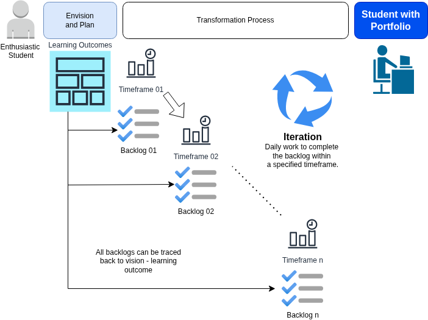
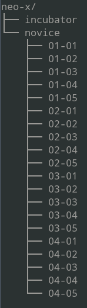

# Pedagogi

Dunia software merupakan dunia yang luas. Tidak memungkinkan untuk mengajarkan dan memberikan bekal ke siswa tentang semua hal. Oleh karena itu, sekolah ini lebih menekankan pada kekuatan konsep melalui _mastery-based learning_ (MBL) sehingga memudahkan adaptasi siswa ke dunia industri serta penguatan pada karir mereka kelak. Konsep yang kuat tidak dilakukan dengan cara memberikan kuliah-kuliah seperti pada perguruan tinggi tetapi melalui latihan dan pembelajaran praktik yang intensif dengan pemahaman ke arah konsep. Siswa hanya akan melanjutkan ke proses berikutnya jika berhasil menunjukkan pemahaman mendalam (_deep understanding and mastery_) pada proses tersebut. Repo ini selanjutnya akan menjelaskan tentang pedagogi yang digunakan di NEO-X School. 

## Garis Besar Umum

Semua kelas dalam semua bentuk di NEO-X School menggunakan mekanisme garis besar proses berikut:



## Proses transformasi

Pedagogi yang digunakan oleh NEO-X School merupakan adaptasi dari [Disciplined Agile](https://www.pmi.org/disciplined-agile/introduction-to-disciplined-agile) yang digunakan untuk proses pembelajaran. Proses transformasi yang diuraikan di bagian ini adalah proses transformasi default. Pada prosesnya, mentor dan siswa akan menentukan WoW (_Way of Working_) yang lebih sesuai untuk batch tersebut dengan pertimbangan utama sebaagi berikut:

1. Proses bisa online maupun offline. Jam dimulai dan berakhir tetap.
2. Presentasi setelah selesai penyelesaian backlog pada timeframe tertentu wajib dilaksanakan secara offline.
3. Target dan proses pengerjaan tetap sama, masalah online atau offline hanya masalah platform.

### Ketentuan Umum

* Pendidikan dilaksanakan pada hari kerja (senin - jumat), dari jam 09:00 - 17:00.
* Peserta menggunakan laptop sendiri, RAM minimal 16 GB, OS yang didukung hanya Linux atau OS berbasis UNIX lainnya.
* Pakaian dan asesoris siswa tidak diatur secara khusus. Meskipun demikian, jika terjadi kasus tertentu, NEO-X School berhak menentukan penggunaan pakaian maupun asesoris yang diperbolehkan.
* Kehadiran sifatnya mutlak. Ketidakhadiran akan menjadi perhatian khusus dan bisa mengarah ke dihentikannya peserta dari proses pendidikan. Masalah seperti ini akan menjadi perhatian internal dan akan dirapatkan oleh internal NEO-X School untuk tindak lanjut dari kondisi tersebut.
* Waktu untuk beribadah tidak boleh diganggu. Siswa dipersilahkan meninggalkan kelas untuk mengerjakan ibadah. Jam untuk ibadah ini tidak ditulis secara khusus tetapi siswa dipersilahkan melaksanakan sesuai dengan jam masing-masing.
* Siswa diminta semaksimal mungkin berkontribusi ke proyek-proyek open source yang ada di GitHub.

### Tahap Pendidikan

Tahap pendidikan ada 3:

* Tahap *incubator*: siswa dianggap mempunyai cukup dasar untuk masuk ke proses. Tahap ini berisi pemberian teori, praktik, dan latihan intensif dengan tujuan untuk membentuk mental dan _skill_. 
* Tahap *capstone*: siswa dianggap siap untuk masuk ke industri. Pada tahap ini, siswa akan mendapatkan tantangan terkait materi secara langsung. Tahap ini mempunyai 2 kemungkinan, yaitu:
  1. Bergabung ke tim pengembang software dalam bentuk **internship**. Kemungkinan ini terjadi jika ada proyek riil. Siswa dilibatkan secara langsung dalam tim dan dibimbing untuk mengerjakan proyek riil tersebut.
  2. **Proyek mandiri**. Kemungkinan ini terjadi jika tidak ada proyek riil. Situasi ini pada dasarnya mempunyai 2 kemungkinan, yaitu tahap **inisiator** dan tahap **team player**. Pada tahap *initiator*, siswa dianggap mempunyai kemampuan yang mencukupi dan mempunyai mental serta inisiatif yang baik dalam materi terkait. Pada tahap ini, siswa berinisiatif membuat software sesuai keinginan pribadi. Pada tahap *team player*, siswa dianggap mempunyai kemampuan individual yang memadai dan bisa menggunakan kemampuan individual mereka untuk pembuatan software secara berkelompok.
* Tahap transisi ke profesional. Pada tahap ini, NEO-X akan menempa siswa dengan berbagai proses pembelajaran yang terkait dengan profesionalisme.

### Incubator

_Tujuan_

Memberikan dasar teori dan praktik yang kuat terhadap materi

_Aktivitas Harian_

Setiap hari, akan dilakukan pemberian materi serta latihan intensif dengan alokasi waktu sebagai berikut:

- Sebelum jam 9: presensi kedatangan
- Jam 9 - 10: pemberian materi, penjelasan serta contoh-contoh oleh mentor.
- Jam 10 - 12: latihan materi dari mentor.
- Jam 13 - 16: latihan kasus lebih kompleks.
- jam 16: presensi pulang.

Setelah selesai, hasil untuk setiap hari di-push ke repo GitHub dengan nama repo **NEO-X**. Pada repo tersebut:

1. Buat file README.md berisi **learning outcomes**
2. Buat direktori `incubator` dan `capstone`. 

Pada direktori `incubator`, buat direktori sesuai dengan timeframe dan hari pelaksanaan:

```
Timeframe-Hari
```

- Timeframe: Timeframe saat pengerjaan (2 digit)
- Hari: Hari saat pengerjaan (2 digit)

Contoh:

`02-03`: repo untuk timeframe `2`, hari ke `3`.

Pada repo tersebut, buat `README.md` dengan isi minimal:

- Judul: Materi hari tersebut
- Oleh: nama siswa
- Tanggal
- Ringkasan materi
- Penjelasan tentang isi repo
- Lisensi

Pada repo tersebut, isikan juga berbagai hasil file yang dikerjakan pada hari itu dengan struktur bebas. File serta strukturnya dijelaskan di dalam file README.md di atas.

Berikut adalah contoh direktori yang dibuat:



Peserta diwajibkan posting ke akun media sosial LinkedIn peserta serta salah satu media sosial lainnya (Facebook, Threads, IG, dan lain-lain), berisi materi yang sudah ditulis di dalam GitHub tersebut dan menyertakan URL ke repo yang mereka buat. Proses ini merupakan salah satu metriks evaluasi penilaian.

Pada akhir dari timeframe, akan dilakukan evaluasi pemahaman oleh mentor. Evaluasi dilaksanakan secara bebas tetapi transparan. Mentor harus menjelaskan apa saja yang akan dievaluasi dan kemudian melaksanakan evaluasi tersebut. Setiap evaluasi akan dibuatkan berita acara. Evaluasi ini dilakukan untuk mewujudkan MBL. Beberapa contoh evaluasi yang bisa dilakukan:

* Ujian teori (tes lisan terkait pemahaman siswa).
* Ujian praktik (tes coding / programming).

Hasil dari pengujian ini adalah kelanjutan siswa di tahap berikutnya: melanjutkan di proses berikutnya atau menguatkan kembali sisi-sisi tertentu sesuai evaluasi dari mentor. Perlu diketahui, evaluasi ini bukan merupakan hal yang bersifat kaku. Siswa bisa kembali mengerjakan proses-proses sebelumnya sampai kemudian mendapatakan pemahamana yang mendalam dan kemudian melanjutkan ke proses berikutnya. Hanya saja, jika ini terjadi maka siswa yang bersangkutan harus bekerja lebih keras lagi untuk mengikuti timeframe sampai selesai.

### Capstone Mandiri - Initiator

_Tujuan_

Siswa melaksanakan penugasan terkait materi secara komprehensif. Hasil akhir dari proses ini adalah artefak dengan lisensi free / open source yang diletakkan pada repo Git (GitHub). _Capstone_ harus direncanakan dengan baik dalam bentuk _milestones_ dan tiket-tiket untuk milestones (dari awal sampai rilis). File README.md diletakkan pada repo untuk menjelaskan tentang isi dari repo. Berbagai artefak seperti arsitektur software, milestones, dan dokumentasi tentang software tersebut diletakkan di berbagai file berformat Markdown di direktori docs.

_Timeframe pertama_

* Hari 1 dan 2: siswa mencari tema dari proyek _capstone_.
* Hari 3: siswa mendiskusikan dengan mentor terkait proyek _capstone_ yang akan dibuat, fitur-fitur, serta milestones untuk menyelesaikan proyek _capstone_ tersebut. Siswa (dengan bantuan mentor) menyiapkan infrastruktur.
* Akhir hari 3: dibuat repo dan dalam repo tersebut dibuat README terkait no 2 di atas.

_Timeframe kedua_

* Hari 1 - timeframe selesai: siswa mulai mengerjakan proyek _capstone_. Siswa mengerjakan pembuatan software dan melengkapi dokumentasi. GitHub releases berisi berbagai rilis (versi Beta, RC1, RC2, dan seterusnya sampai dengan rilis).
* Hari terakhir _timeframe_, siswa mempresentasikan hasil pekerjaan. Tim akademik dan mentor melakukan penilaian serta pengujian. Hasil penilaian ini menentukan apakah siswa berhasil masuk ke tahap berikutnya atau gagal. Jika gagal, siswa akan diberi waktu untuk memperbaiki hasil dan kemudian akan dilakukan evaluasi ulang.

### Capstone Mandiri - Team Player

_Tujuan_

Tahap ini digunakan untuk melatih kemampuan bekerjasama antar siswa. Team ditentukan oleh akademik dan terdiri atas 3-5 siswa. Tim telah dibentuk sebelum memasuki tahap ini. Pada tahap ini, tim bekerja sama untuk mengerjakan task proyek _capstone_ untuk dinilai.

_Timeframe pertama_

* Hari 1 dan 2: tim melakukan brainstorming untuk menentukan proyek _capstone_ yang akan dibuat.
* Hari 2: pemberian berbagai materi sesuai konteks proyek _capstone_ serta penggunaan GItHub untuk mengelola proyek bersama.
* Hari 3: tim mendiskusikan dengan mentor terkait proyek _capstone_ yang akan dibuat, fitur-fitur, serta milestones untuk menyelesaikan proyek _capstone_ tersebut. Tim (dengan bantuan mentor) menyiapkan infrastruktur untuk penyelesaian proyek _capstone_.
* Akhir hari 3: dibuat repo dan dalam repo tersebut dibuat README terkait no 2 di atas.

_Timeframe kedua_ 

* Hari 1 - selesai (sesuai rancangan): siswa mulai mengerjakan pembuatan proyek _capstone_ secara iteratif. Siswa mengikuti ritme pengerjaan proyek, termasuk mengalami deadline, pull request ditolak (jika ada), stand up meeting, dan lain-lain.

Pada akhir _timerame_ kedua, bagian akademik serta mentor melakukan evaluasi komprehensif terhadap kemampuan dari siswa dengan melihat hasil GitHub personal maupun tim. Pada hari ini, tim mempresentasikan hasil kerja kelompok. Bagian akademik serta para mentor memutuskan siswa yang berhasil lulus dari NEO-X School serta siswa yang tidak berhasil lulus dari NEO-X School.
